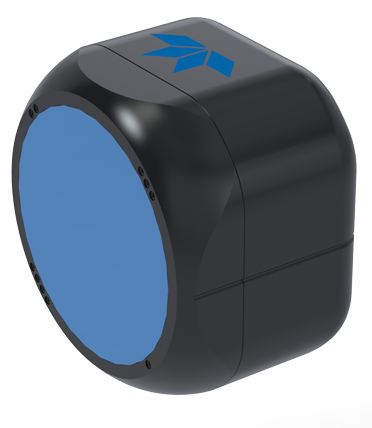

# Wayfinder Python Driver
Python driver for communication with a Wayfinder DVL  

Contents  
* [What is a Wayfinder?](https://github.com/Teledyne-Marine/Wayfinder#What-is-a-Wayfinder?)  
* [Documentation](https://github.com/Teledyne-Marine/Wayfinder#Documentation)  
* [Sample code](https://github.com/Teledyne-Marine/Wayfinder#Sample-code)  
* [Installation](https://github.com/Teledyne-Marine/Wayfinder#Installation)  
* [Requirements](https://github.com/Teledyne-Marine/Wayfinder#Requirements)  
* [Usage](https://github.com/Teledyne-Marine/Wayfinder#Usage)  
* [Links](https://github.com/Teledyne-Marine/Wayfinder#Links)  
* [Contact](https://github.com/Teledyne-Marine/Wayfinder#Contact)  

## What is a Wayfinder?
The Wayfinder Doppler Velocity Log (DVL) is an underwater sensor that has been designed to provide Doppler navigation capability for micro vehicles, which are often constrained by stringent size, weight and budget limitations. 

## Documentation

* Full documentation for the **product** is available [here](https://teledynerdi.myshopify.com#Documentation)

* Full documentation for the **driver** is available [here](https://teledynerdi.myshopify.com/pages/wayfinder-driver-index)

## Sample code
Samples of how to use the driver can be found in the `examples` directory

## Installation
To install the `dvl` module, cd to the `dvl` directory and use `pip`

    $ pip install .

## Requirements

* `Python` 3.6 or later  

* `pip` 20.0 or later

* `pyserial` 3.4 or later

* `numpy`

## Usage
To connect to the Wayfinder DVL and then retrieve the setup and print it:

    from dvl.dvl import Dvl

    with Dvl() as DVL:

        # Connect to serial port on COM1
        if DVL.connect("COM1"):

            # Get user system setup
            if DVL.get_setup():

                # Print setup 
                print (DVL.system_setup)

## Links
[Wayfinder Store](https://teledynerdi.myshopify.com/)

## Contact
Telephone: +1-858-842-2700  
Email: rdifs@teledyne.com  
Website: http://www.teledynemarine.com/rdi/support

## License
Copyright 2020 Teledyne Marine
Permission is hereby granted, free of charge, to any person obtaining a copy of this software and associated documentation files (the "Software"), to deal in the Software without restriction, including without limitation the rights to use, copy, modify, merge, publish, distribute, sublicense, and/or sell copies of the Software, and to permit persons to whom the Software is furnished to do so, subject to the following conditions:
The above copyright notice and this permission notice shall be included in all copies or substantial portions of the Software.
THE SOFTWARE IS PROVIDED "AS IS", WITHOUT WARRANTY OF ANY KIND, EXPRESS OR IMPLIED, INCLUDING BUT NOT LIMITED TO THE WARRANTIES OF MERCHANTABILITY, FITNESS FOR A PARTICULAR PURPOSE AND NONINFRINGEMENT. IN NO EVENT SHALL THE AUTHORS OR COPYRIGHT HOLDERS BE LIABLE FOR ANY CLAIM, DAMAGES OR OTHER LIABILITY, WHETHER IN AN ACTION OF CONTRACT, TORT OR OTHERWISE, ARISING FROM, OUT OF OR IN CONNECTION WITH THE SOFTWARE OR THE USE OR OTHER DEALINGS IN THE SOFTWARE.
